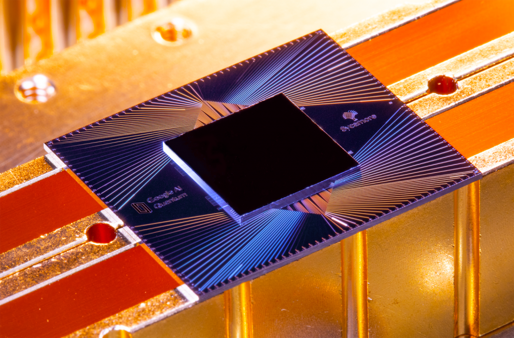

The science that deals with the description of the motion and interaction of subatomic particles is known as Quantum Mechanics. Traditional computers utilize the physics of electricity, the flow of electrons controlled by switches, to control their logic. Quantum computers rely instead on the physical properties of electrons, photons, and other tiny bits of matter which are subjected to the laws of quantum mechanics.

This kind of tiny matter is best described in states called amplitudes (which can act as particles and waves). A particle can have two different amplitudes at the same time, which is a state called superposition. A particle can also be entangled, meaning a change in one particle instantly changes the entangled counterpart. The amplitudes of particles can also cancel one another out like opposing waves in water would. The smallest particles in nature don’t really exist at a point in space but they exist as a probability of existing. Quantum computers take advantage of these phenomena.

To deliver on the promise of quantum computing and solve problems that will forever change the future, we need a scalable quantum computer. Such a computer would apply the properties of quantum physics (like entanglement, superposition, etc.) to the processing of information. This computer would have the potential to solve the world’s toughest challenges. In the future, this will enable new discoveries in the areas of healthcare, smart materials, and beyond.

## Classical vs Quantum?

Where a classical bit holds a single binary value as 0 or 1, a [qubit](https://en.wikipedia.org/wiki/Qubit) can hold both values at the same time. This means a single qubit can contain exponentially more information than the traditional bit. This is due to superposition. When many qubits are made to act coherently, they can process multiple operations at the same time. This unique property allows them to process information in potentially log-time, or in other words, exponentially faster.

Quantum computers are hard to build and are prone to generating errors, and their components are often unstable. In quantum computing, [quantum supremacy](https://en.wikipedia.org/wiki/Quantum_supremacy) is the ultimate goal of solving a problem that a classical or non-quantum computer system might take billions of years to solve. In 2018, 20 qubits were entangled together are were made to talk to one another, then read back the information they individually contained. This was a sort of prototype of the short-term memory of the quantum-computer system.

## Google Claims Quantum Supremacy

In 2019, Google declared that they had achieved quantum supremacy. Google had built a quantum computer that would perform tasks faster than the classical computer. Their computer completed a computation in just 200 seconds (using a chip named [Sycamore](https://ai.googleblog.com/2019/10/quantum-supremacy-using-programmable.html)) which they claimed would take 10,000 years for a traditional supercomputer to solve (which was contested by IBM, who said it would only take 2.5 years).

## Hello, Quantum Revolution!

Google's quantum computer consisted of 53 qubits in a complex superposition state, defined as quantum supremacy in the near-term devices. But quantum supremacy has not been tested for highly complex states. On paper, it is very easy to show why and how a quantum computer can outperform the classical computer, but the implementation can be more challenging.

Google's achievement is certainly a breakthrough for quantum computing but is still in its infancy. Practical, everyday quantum computers are still a ways away. The classical cost of simulating the quantum circuit increases exponentially as the circuit volume of the circuit increases. A fully error-corrected and scalable quantum machine is yet to be achieved.

## Related Reading

- [Is AES-256 Quantum Resistant?](https://qvault.io/2019/07/09/is-aes-256-quantum-resistant/)
- [Quantum Programming 101: Backend Monitor](https://qvault.io/2020/05/12/quantum-programming-101-backend-monitor/)
- [Quantum Programming 101: Superdense Coding Tutorial](https://qvault.io/2020/04/20/quantum-programming-101-superdense-coding-tutorial/)
