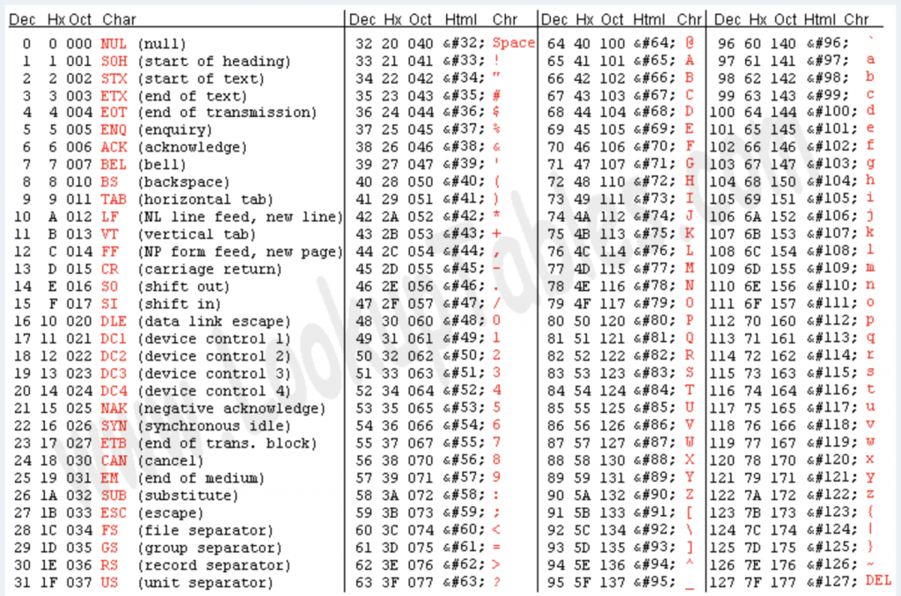
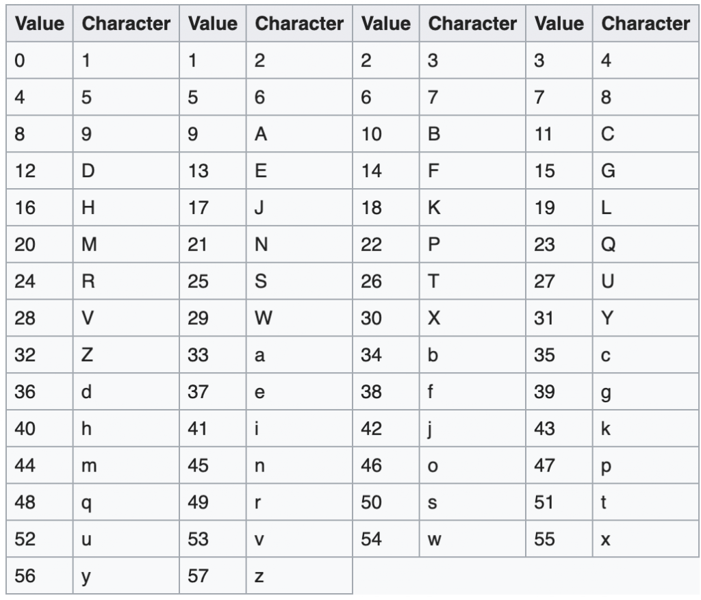

Base64 is one of the most popular encoding formats for representing data. Have some binary data? Base64 encodes it for convenient readability and parsing. Base58 is just another encoding format (with 58 characters instead of 64, and has gained popularity largely due to Bitcoin and other cryptocurrencies. Also, if you came here confused, encryption and encoding are not the same! Take a look at this article for more [information on encryption vs encoding](https://qvault.io/2019/08/14/stop-with-the-obfuscation-encoding-and-encryption-are-not-the-same/).

When it comes to data _encoding_, there is typically a trade-off made between:

- **Human Readability**: Do humans have a good idea of what is being represented at a glance?
- **Efficient data compression**: How many bytes are used to represent the same data, and how many characters are available?

Let's rank Base58, Base64, and ASCII encoding against each other using these metrics!

## First: A Note on Binary

All data is stored in a raw binary format on computers. These encoding formats (Base64, Base58, and ASCII) are just different ways of reading and writing binary data. For example, in Base64 the binary code `000000` represents the letter `A`, but in ASCII the binary `00000000` represents the `NUL` character.

## ASCII Encoding

### Human Readability Rank: 1st

Not all human language characters are possible using ASCII, but the most important ones are. ASCII is meant to be used in applications that need a simple way to represent Latin-based text, the Arabic numerals, and formatting characters like newlines and spacing. ASCII is based on how typewriters worked in the pre-computer days.

### Data Compression Rank: 3rd

Each character (typically) takes an entire byte (8 bits) of data. In order to represent the `NUL` character, we need to store `00000000`, which is a lot of wasted zeros! It is worth noting that ASCII can work with only 7 bits, but because computers work in base-2, it is more simple to use a full byte.

You could also call ASCII Base128 because its alphabet is made up of 128 characters.

## Base64

### Human Readability Rank: 3rd

> Base64 is designed to carry data stored in binary formats across channels that only reliably support text content
> 
> [https://en.wikipedia.org/wiki/Base64](https://en.wikipedia.org/wiki/Base64)

Base64 was essentially designed to trick computers... kind of. When we have binary but are only allowed to transport or display text, Base64 is a great choice.

### Data Compression Rank: 2nd

Each character only takes 6 bits of data, and a padding character, **`=`**, is used to round to the nearest multiple of 4.

## Base58

### Human Readability Rank: 2nd

Satoshi Nakamoto, also the anonymous creator of Bitcoin, invented Base58. The goal was to get data compression levels comparable to that of Base64 but to make it easier for humans to read by eliminating characters that look similar to 0 (zero), O (capital o), I (capital i), l (lower case L). Alphanumeric characters `+` (plus) and `/` (slash) were also omitted for readability.

[https://en.wikipedia.org/wiki/Base58](https://en.wikipedia.org/wiki/Base58)

### Data Compression Rank: 3rd

Very similar to that of Base64, but due to 6 fewer characters, not quite as efficient. Additionally, the parsing is slightly more awkward due to the base not being a power of 2.

Take a look at some of our other crypto and Bitcoin articles:

- [Achieving Data Integrity Using Cryptography](https://qvault.io/2020/05/04/achieving-data-integrity-using-cryptography/)
- [Top 10 Online Crypto Communities 2020](https://qvault.io/2020/01/08/top-10-online-crypto-communities-2020/)
- [Is AES-256 Quantum Resistant?](https://qvault.io/2019/07/09/is-aes-256-quantum-resistant/)
- [(Very) Basic Intro To Elliptic Curve Cryptography](https://qvault.io/2019/12/31/very-basic-intro-to-elliptic-curve-cryptography/)
